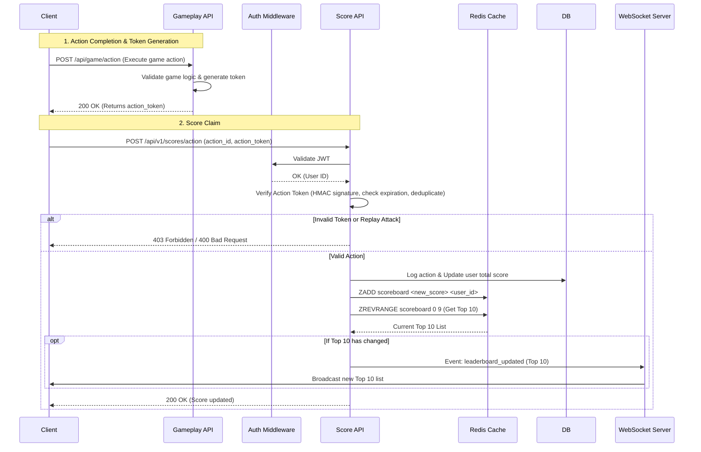

# Scoreboard API Service Module - Specification

This module handles real-time user score tracking and live top 10 leaderboard updates. It is designed to be scalable, secure, and performant.

*Author notes: The specification is designed using Behavior-Driven Development (BDD) based on my initial architecture to clearly outline the system's expected behavior from an outside-in perspective, professional in software development.*

---

## 1. System Architecture Components
* **Database (PostgreSQL):** Source of truth, saving raw user data and action logs.
* **In-Memory Cache (Redis):** Stores the current scoreboard state via Redis Sorted Sets (`ZADD`, `ZREVRANGE`) to ensure fast leaderboard updates / retrievals.
* **WebSocket Server / Server-Sent Events (SSE):** Manages persistent connections to clients for live leaderboard updates, preventing clients from calling the API multiple times.
* **Message Broker (Kafka / Redis PubSub):** Decouples the API from the WebSocket servers to allow instance scaling (horizontal scaling)

---

## 2. Behavior Specifications

### Feature: User Score Updates 
**As a** game developer  
**I want** to securely update user scores upon action completion  
**So that** players are fairly rewarded.

#### Scenario: Successfully updating a user's score (assume Gameplay API is available)

*Note: To ensure the fairness of the leaderboard, the API should be implemented using a secure token to verify the action completion, which can be hooked via other system like Gameplay API (assumed).*

**Given** a user has successfully completed a game action (via Gameplay API call)
**And** the client received a valid `action_token` from the Gameplay API (which is a combination of action_id, user_id, timestamp)
**And** the user has a valid JWT token
**When** the client sends a `POST` request to `/api/v1/scores/action`
**And** the request header contains `"Authorization": "Bearer <JWT_TOKEN>"`
**And** the request body contains:
```json
{
  "action_id": "string",
  "action_token": "string",
  "timestamp": 1715000000
}
```
**Then** the API verifies the `action_token` using the shared backend secret
**And** the API updates the user's score (base on the corresponding action data retrieved from action_id) in the Database and Redis Cache
**And** the API responds with `200 OK`
**And** the response body contains the updated total score:
```json
{
  "success": true,
  "data": {
    "user_id": "uuid",
    "new_total_score": 1550,
    "points_awarded": 15
  }
}
```

#### Scenario: Successfully updating a user's score (without Gameplay API)

*Note: In case of no Gameplay API, the client can send a request to the Score API directly, which can be less secure. The client should use a hidden secret key to generate the action_token.*

**Given** a user has successfully completed a game action
**And** the user has a valid JWT token
**When** the client sends a `POST` request to `/api/v1/scores/action`
**And** the request header contains `"Authorization": "Bearer <JWT_TOKEN>"`
**And** the request body contains:
```json
{
  "action_id": "string",
  "action_token": "string", // generated by client using secret key, which is a combination of action_id, user_id, score, timestamp
  "timestamp": 1715000000
}
```
**Then** the API verifies the `action_token` using the secret key
**And** the API updates the user's score in the Database and Redis Cache
**And** the API responds with `200 OK`
**And** the response body contains the updated total score:
```json
{
  "success": true,
  "data": {
    "user_id": "uuid",
    "new_total_score": 1550,
    "points_awarded": 15
  }
}
```

#### Scenario: Rejecting forged or unauthorized score requests
**Given** a malicious user attempts to forge a score update
**When** the client sends a `POST` request to `/api/v1/scores/action` with an invalid/forged `action_token`
**Then** the API's signature verification process fails
**And** the API rejects the request with a `403 Forbidden` error
**And** the user's score remains unchanged in the database

#### Scenario: Preventing replay attacks (Duplicate actions)
**Given** a client previously successfully updated their score with a specific `action_token` and `action_id`
**When** the client sends another `POST` request using the exact same `action_token`
**Then** the API identifies the token as already used or expired (~60 seconds limit)
**And** the API rejects the request with a `400 Bad Request` or `403 Forbidden`
**And** the user's score remains unchanged

#### Scenario: Enforcing Rate Limits
**Given** a client is sending API requests to the Score API
**When** the client exceeds the strict limit of 5 requests per second
**Then** the API blocks the subsequent requests
**And** responds with a `429 Too Many Requests` error to deter brute-force bots

---

### Feature: Live Leaderboard Updates
**As a** player  
**I want** to view the Top 10 leaderboard  
**So that** I can see real-time rankings without constantly refreshing my screen.

#### Scenario: Fetching the initial Top 10 Leaderboard
**Given** the leaderboard contains existing user scores
**When** a client sends a `GET` request to `/api/v1/scores/top`
**Then** the API responds with `200 OK`
**And** the response contains the top 10 users ranked by score:
```json
{
  "success": true,
  "data": [
    { "user_id": "user1", "score": 5000 },
    { "user_id": "user2", "score": 4850 }
  ]
}
```

#### Scenario: Establishing a Live Leaderboard WebSocket Connection
**Given** a client wants to receive real-time leaderboard updates
**When** the client initiates a WebSocket connection to `ws://<api_domain>/leaderboard`
**And** provides a valid Bearer JWT during the initial handshake
**Then** the server validates the connection
**And** the server accepts the connection and immediately pushes the current Top 10 list
**And** the connection is kept open listening to the internal Message Broker

#### Scenario: Broadcasting Optimized Delta Updates
**Given** multiple clients have an active WebSocket connection
**When** a user's score update alters the Top 10 standings
**Then** the server calculates the Delta Updates (throttled to at most once per second)
**And** the server broadcasts a `leaderboard_update` event to all connected clients
**And** the `updated_users` payload includes *every* user whose rank or score changed (new entrants, promoted, and bumped down slots)
**And** the `dropped_users` payload includes any users pushed out of the Top 10:
```json
{
  "event": "leaderboard_update",
  "data": {
    "updated_users": [
      { "user_id": "user12", "score": 5100, "new_rank": 1 },
      { "user_id": "user3", "score": 4900, "new_rank": 2 },
      { "user_id": "user2", "score": 4850, "new_rank": 3 }
    ],
    "dropped_users": ["user10"]
  },
  "timestamp": 1715000100
}
```

---

## 3. Execution Flow Diagram



---

## 4. Engineering Notes for Improvement

* **Event-Driven Architecture:** If the volume of actions is extremely high, updating the database synchronously during the API call may become a bottleneck. We can push valid score updates to a Message Queue (like Kafka or RabbitMQ) and have background workers process DB writes and Redis updates asynchronously.
* **Idempotency keys:** Clients should pass a unique `Idempotency-Key` header with retried requests to ensure network hiccups don't result in double-awarding points for the exact same transaction.
* **Handling Tied Scores:** Redis Sorted Sets rank elements with the same score by lexicographical order of the value (`user_id`). For fairness, secondary sorting logic (e.g., "who reached the score first") can be implemented by appending a additional score (e.g. timestamp) to the score in Redis.
